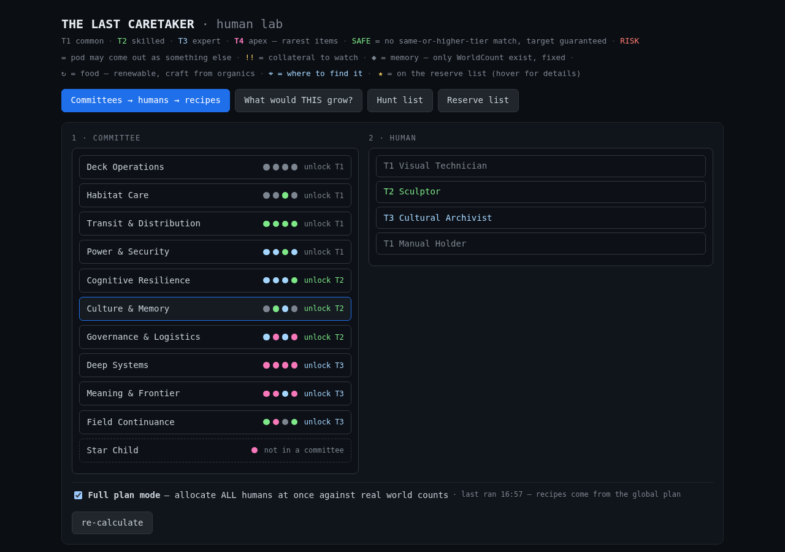
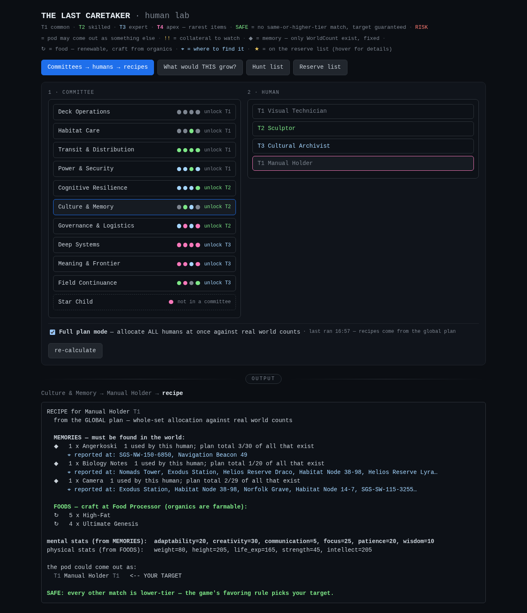
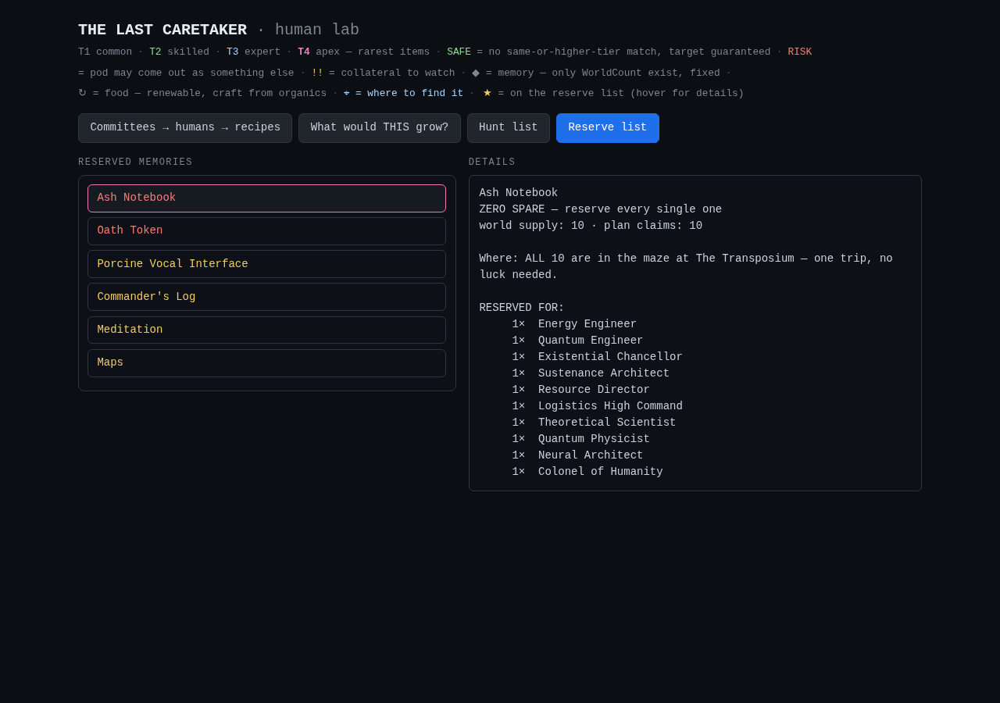

# The Last Caretaker — Human Recipe Solver

A local web tool for [The Last Caretaker](https://store.steampowered.com/app/1783560/) that answers one question:

> **What exact memories and foods do I need to grow each committee human — and which of those items are so rare that I must not waste a single one?**

## What it does

Growing a human means feeding a seed a mix of **memories** and **crafted foods** whose stats add up to the profession's requirements. The catch: foods are renewable (craft from farmable organics), but **memories are fixed** — the world contains exactly N of each. Ash Notebooks exist exactly 10 times, total. Spend one on the wrong human and a T4 committee member is gone forever.

This tool:

- **Recipes for all 40 committee humans** — pick a committee, pick a human, get the exact item list.
- **Global allocation** — instead of solving each human alone (which happily spends all 10 Ash Notebooks twice), an ILP (integer linear program) allocates *all humans at once* against real world counts, and proves which items have **zero slack**.
- **Reserve list** — the items you should treat as sacred, which human each copy is saved for, and where to find them in the world.
- **Collateral safety** — for each recipe it tells you whether a *different* profession could match the same stats (SAFE / RISK), using the game's tier-favoring rule.

## Screenshots

Pick a committee (dots = each member's tier), then a human:



The recipe splits into **memories you must hunt** (fixed in the world) and **foods you just craft**. ★ marks reserve-list items — hover for why. Mental stats come from memories, physical from food:



The reserve tab: zero-slack items in red, click any for the human-by-human allocation:



## Quick start

```bash
python3 -m venv .venv
.venv/bin/pip install pulp          # the ILP solver (CBC ships with it)
.venv/bin/python webapp.py 0.0.0.0  # → http://localhost:8765
```

That's it. Everything runs locally — no accounts, no network calls, no telemetry. The web UI reads CSVs in `data/` (scraped from the community wiki) and serves a single-page app.

**Full plan mode** (the checkbox) runs the global ILP in a subprocess — a few minutes on first run, results cached to `global_plan.json`. Without it, recipes use a greedy plan that's still 40/40 feasible, just less optimal on rare items.

## How the solver works (one paragraph)

For each human, it picks a multiset of foods and memories minimizing a weighted cost of *items used, scarcity burned, and collateral risk*, subject to: stat sums ≥ requirements, at most one same-or-higher-tier profession matching (else the pod might grow into something else), and — in global mode — a hard cap that **no memory is used more times than exists in the world, across the entire plan**. CBC (bundled with `pulp`) solves it to proven optimality in minutes; if it times out it keeps the best found solution and says so.

## Known game facts it encodes

- Foods are **craftable** → effectively infinite. Memories are **fixed** (`WorldCount` = literal copies in the world).
- The game **favors higher tiers**: a T4 recipe is SAFE if every other profession its stats satisfy is lower-tier.
- Grow **rare first**: T4s consume the scarce memories; T1s can substitute commons.

## Files

| file | what |
|---|---|
| `webapp.py` | the whole web UI + API (stdlib `http.server`, no deps) |
| `solver.py` | the ILP model (PuLP/CBC) — also a CLI: `solve`, `combo`, `hunt` |
| `solve_all.py` | global all-humans solve, writes `global_plan.json` |
| `make_reserve.py` | renders `RESERVE.md` from the current plan |
| `data/*.csv` | foods, memories, humans (from the [wiki](https://thelastcaretaker.wiki.gg/)) |

## Credits

Game data from the [Last Caretaker wiki](https://thelastcaretaker.wiki.gg/) and [Root-DE/LastCaretaker](https://github.com/Root-DE/LastCaretaker). Location and Oath Token details from community wiki/Reddit/Steam findings — the game is in active development, so treat in-game behavior as ground truth over this tool.

---

*Built with AI assistance (Hermes/Qwen). Game data scraped from the community wiki — accuracy follows the community, not an authority.*
